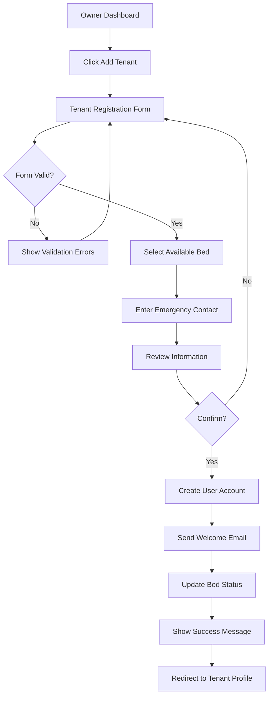
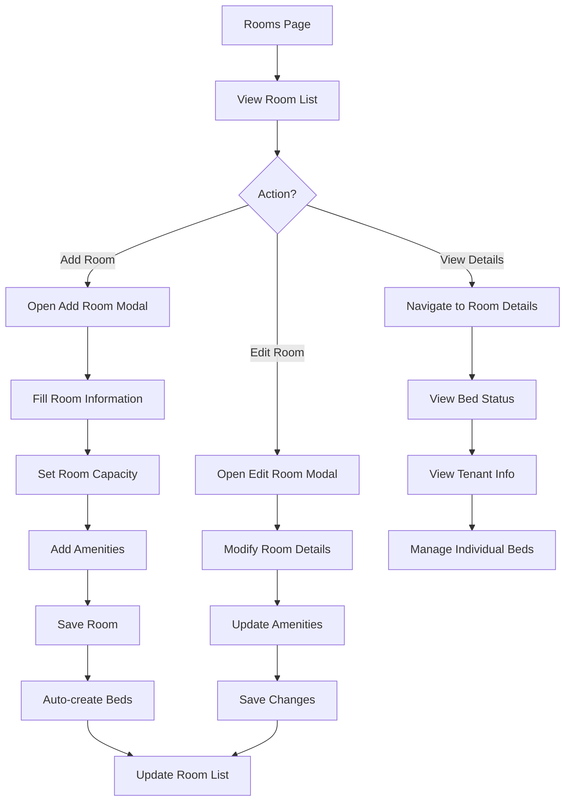
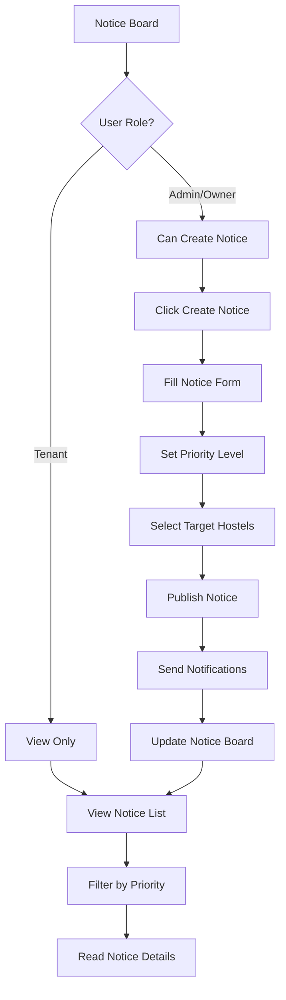

# Hostel/PG Management SaaS - UI/UX Design Guide

## Design System Overview

### Brand Identity
- **Primary Color**: #007bff (Blue) - Trust, professionalism
- **Secondary Color**: #6c757d (Gray) - Balance, neutrality
- **Success Color**: #28a745 (Green) - Positive actions
- **Warning Color**: #ffc107 (Amber) - Caution
- **Danger Color**: #dc3545 (Red) - Errors, deletions
- **Info Color**: #17a2b8 (Cyan) - Information

### Typography
```css
/* Font Family */
--font-primary: 'Inter', -apple-system, BlinkMacSystemFont, sans-serif;
--font-mono: 'JetBrains Mono', monospace;

/* Font Sizes */
--text-xs: 0.75rem;    /* 12px */
--text-sm: 0.875rem;   /* 14px */
--text-base: 1rem;     /* 16px */
--text-lg: 1.125rem;   /* 18px */
--text-xl: 1.25rem;    /* 20px */
--text-2xl: 1.5rem;    /* 24px */
--text-3xl: 1.875rem;  /* 30px */
--text-4xl: 2.25rem;   /* 36px */

/* Font Weights */
--font-normal: 400;
--font-medium: 500;
--font-semibold: 600;
--font-bold: 700;
```

### Spacing System
```css
/* Spacing Scale */
--space-1: 0.25rem;   /* 4px */
--space-2: 0.5rem;    /* 8px */
--space-3: 0.75rem;   /* 12px */
--space-4: 1rem;      /* 16px */
--space-5: 1.25rem;   /* 20px */
--space-6: 1.5rem;    /* 24px */
--space-8: 2rem;      /* 32px */
--space-10: 2.5rem;   /* 40px */
--space-12: 3rem;     /* 48px */
--space-16: 4rem;     /* 64px */
```

## Component Library

### 1. Navigation Components

#### Navbar
```tsx
// Desktop Navbar Structure
<Navbar>
  <NavbarBrand>
    <Logo />
    <OrganizationName />
  </NavbarBrand>
  
  <NavbarCenter>
    <SearchBar placeholder="Search rooms, tenants..." />
  </NavbarCenter>
  
  <NavbarEnd>
    <NotificationBell count={3} />
    <UserMenu>
      <Avatar />
      <Dropdown>
        <MenuItem>Profile</MenuItem>
        <MenuItem>Settings</MenuItem>
        <MenuItem>Logout</MenuItem>
      </Dropdown>
    </UserMenu>
  </NavbarEnd>
</Navbar>
```

#### Sidebar
```tsx
// Role-based Sidebar Navigation
<Sidebar>
  <SidebarSection title="Main">
    <SidebarItem icon={<Home />} label="Dashboard" href="/dashboard" />
    <SidebarItem icon={<Building />} label="Hostels" href="/hostels" badge="3" />
  </SidebarSection>
  
  <SidebarSection title="Management">
    <SidebarItem icon={<Door />} label="Rooms" href="/rooms" />
    <SidebarItem icon={<Bed />} label="Beds" href="/beds" />
    <SidebarItem icon={<Users />} label="Tenants" href="/tenants" />
  </SidebarSection>
  
  <SidebarSection title="Communication">
    <SidebarItem icon={<Bell />} label="Notices" href="/notices" />
    <SidebarItem icon={<FileText />} label="Reports" href="/reports" />
  </SidebarSection>
</Sidebar>
```

### 2. Dashboard Components

#### Stats Card
```tsx
<StatsCard>
  <StatsIcon>
    <BedIcon className="text-primary" />
  </StatsIcon>
  <StatsContent>
    <StatsLabel>Total Beds</StatsLabel>
    <StatsValue>250</StatsValue>
    <StatsChange positive>
      <TrendingUp /> +12% from last month
    </StatsChange>
  </StatsContent>
</StatsCard>
```

#### Occupancy Chart
```tsx
<ChartCard title="Occupancy Trends" subtitle="Last 30 days">
  <ResponsiveContainer width="100%" height={300}>
    <AreaChart data={occupancyData}>
      <defs>
        <linearGradient id="colorOccupancy" x1="0" y1="0" x2="0" y2="1">
          <stop offset="5%" stopColor="#007bff" stopOpacity={0.8}/>
          <stop offset="95%" stopColor="#007bff" stopOpacity={0}/>
        </linearGradient>
      </defs>
      <CartesianGrid strokeDasharray="3 3" />
      <XAxis dataKey="date" />
      <YAxis />
      <Tooltip />
      <Area 
        type="monotone" 
        dataKey="occupancy" 
        stroke="#007bff" 
        fillOpacity={1} 
        fill="url(#colorOccupancy)" 
      />
    </AreaChart>
  </ResponsiveContainer>
</ChartCard>
```

### 3. Data Display Components

#### Data Table
```tsx
<DataTable
  columns={[
    { key: 'roomNumber', label: 'Room No.', sortable: true },
    { key: 'floor', label: 'Floor', sortable: true },
    { key: 'type', label: 'Type', render: (value) => <Badge>{value}</Badge> },
    { key: 'status', label: 'Status', render: (value) => <StatusBadge status={value} /> },
    { key: 'actions', label: '', render: (row) => <ActionMenu row={row} /> }
  ]}
  data={rooms}
  pagination={{
    page: 1,
    pageSize: 20,
    total: 100
  }}
  onSort={handleSort}
  onPageChange={handlePageChange}
/>
```

#### Room Card
```tsx
<RoomCard>
  <RoomCardHeader>
    <RoomNumber>201</RoomNumber>
    <RoomType variant="double">Double</RoomType>
  </RoomCardHeader>
  
  <RoomCardBody>
    <RoomInfo>
      <InfoItem icon={<Users />} label="Capacity" value="2" />
      <InfoItem icon={<Bed />} label="Occupied" value="1" />
    </RoomInfo>
    
    <BedGrid>
      <BedSlot status="occupied" number="201-A" tenant="John Doe" />
      <BedSlot status="vacant" number="201-B" />
    </BedGrid>
  </RoomCardBody>
  
  <RoomCardFooter>
    <Button variant="outline" size="sm">View Details</Button>
    <Button variant="primary" size="sm">Manage Beds</Button>
  </RoomCardFooter>
</RoomCard>
```

### 4. Form Components

#### Tenant Registration Form
```tsx
<Form onSubmit={handleSubmit}>
  <FormSection title="Personal Information">
    <FormRow>
      <FormField>
        <Label required>First Name</Label>
        <Input type="text" placeholder="Enter first name" />
      </FormField>
      
      <FormField>
        <Label required>Last Name</Label>
        <Input type="text" placeholder="Enter last name" />
      </FormField>
    </FormRow>
    
    <FormRow>
      <FormField>
        <Label required>Email</Label>
        <Input type="email" placeholder="tenant@example.com" />
      </FormField>
      
      <FormField>
        <Label required>Phone</Label>
        <PhoneInput placeholder="+91 98765 43210" />
      </FormField>
    </FormRow>
  </FormSection>
  
  <FormSection title="Room Assignment">
    <FormRow>
      <FormField>
        <Label required>Select Hostel</Label>
        <Select placeholder="Choose hostel">
          <Option value="1">Downtown Hostel</Option>
          <Option value="2">City Center PG</Option>
        </Select>
      </FormField>
      
      <FormField>
        <Label required>Select Bed</Label>
        <BedSelector 
          hostelId={selectedHostel}
          onSelect={setBedId}
        />
      </FormField>
    </FormRow>
  </FormSection>
  
  <FormActions>
    <Button variant="outline">Cancel</Button>
    <Button variant="primary" type="submit">Register Tenant</Button>
  </FormActions>
</Form>
```

### 5. Interactive Components

#### Search and Filter Bar
```tsx
<SearchFilterBar>
  <SearchInput 
    placeholder="Search by name, room, or phone..."
    icon={<Search />}
    onChange={handleSearch}
  />
  
  <FilterGroup>
    <FilterDropdown
      label="Status"
      options={[
        { value: 'all', label: 'All' },
        { value: 'active', label: 'Active' },
        { value: 'inactive', label: 'Inactive' }
      ]}
      onChange={handleStatusFilter}
    />
    
    <FilterDropdown
      label="Hostel"
      options={hostels}
      onChange={handleHostelFilter}
    />
    
    <DateRangePicker
      label="Date Range"
      onChange={handleDateFilter}
    />
  </FilterGroup>
  
  <FilterActions>
    <Button variant="ghost" size="sm" onClick={clearFilters}>
      Clear Filters
    </Button>
  </FilterActions>
</SearchFilterBar>
```

#### Modal Dialog
```tsx
<Modal isOpen={isOpen} onClose={handleClose}>
  <ModalHeader>
    <ModalTitle>Assign Owner to Hostel</ModalTitle>
    <ModalCloseButton onClick={handleClose} />
  </ModalHeader>
  
  <ModalBody>
    <FormField>
      <Label>Select User</Label>
      <UserSelector 
        role="OWNER"
        excludeAssigned
        onSelect={setSelectedUser}
      />
    </FormField>
    
    <Alert variant="info">
      <AlertIcon />
      <AlertDescription>
        The selected user will have full management access to this hostel.
      </AlertDescription>
    </Alert>
  </ModalBody>
  
  <ModalFooter>
    <Button variant="outline" onClick={handleClose}>Cancel</Button>
    <Button variant="primary" onClick={handleAssign}>Assign Owner</Button>
  </ModalFooter>
</Modal>
```

## User Flow Diagrams

### 1. Tenant Check-in Flow



### 2. Room Management Flow



### 3. Notice Board Flow



## Mobile Responsive Design

### Breakpoints
```css
/* Mobile First Approach */
--mobile: 0px;      /* Default */
--tablet: 768px;    /* md */
--desktop: 1024px;  /* lg */
--wide: 1280px;     /* xl */
```

### Mobile Navigation Pattern
```tsx
// Mobile Navigation Drawer
<MobileNav>
  <MobileHeader>
    <HamburgerMenu onClick={toggleDrawer} />
    <Logo compact />
    <NotificationIcon />
  </MobileHeader>
  
  <Drawer isOpen={drawerOpen} position="left">
    <DrawerHeader>
      <UserInfo compact />
    </DrawerHeader>
    
    <DrawerBody>
      <NavItems vertical />
    </DrawerBody>
    
    <DrawerFooter>
      <LogoutButton fullWidth />
    </DrawerFooter>
  </Drawer>
</MobileNav>
```

### Responsive Grid Layouts
```tsx
// Responsive Room Grid
<Grid
  templateColumns={{
    base: "1fr",           // Mobile: 1 column
    md: "repeat(2, 1fr)",  // Tablet: 2 columns
    lg: "repeat(3, 1fr)",  // Desktop: 3 columns
    xl: "repeat(4, 1fr)"   // Wide: 4 columns
  }}
  gap={4}
>
  {rooms.map(room => (
    <RoomCard key={room.id} room={room} />
  ))}
</Grid>
```

## Accessibility Guidelines

### WCAG 2.1 AA Compliance
1. **Color Contrast**
   - Normal text: 4.5:1 ratio
   - Large text: 3:1 ratio
   - Interactive elements: 3:1 ratio

2. **Keyboard Navigation**
   - All interactive elements accessible via Tab
   - Focus indicators visible
   - Skip navigation links
   - Logical tab order

3. **Screen Reader Support**
   - Semantic HTML structure
   - ARIA labels for icons
   - Form field descriptions
   - Error announcements

4. **Interactive Elements**
   - Minimum touch target: 44x44px
   - Clear hover/focus states
   - Loading state announcements
   - Error state descriptions

### Accessibility Implementation
```tsx
// Accessible Button Component
<Button
  aria-label="Add new tenant"
  aria-pressed={isPressed}
  aria-disabled={isLoading}
  role="button"
  tabIndex={0}
  onKeyDown={handleKeyDown}
>
  {isLoading ? (
    <>
      <Spinner aria-hidden="true" />
      <span className="sr-only">Loading...</span>
    </>
  ) : (
    <>
      <PlusIcon aria-hidden="true" />
      <span>Add Tenant</span>
    </>
  )}
</Button>
```

## Loading States

### Skeleton Loaders
```tsx
// Table Skeleton
<TableSkeleton>
  <SkeletonRow>
    <SkeletonCell width="20%" />
    <SkeletonCell width="30%" />
    <SkeletonCell width="25%" />
    <SkeletonCell width="25%" />
  </SkeletonRow>
  {[...Array(5)].map((_, i) => (
    <SkeletonRow key={i}>
      <SkeletonCell />
      <SkeletonCell />
      <SkeletonCell />
      <SkeletonCell />
    </SkeletonRow>
  ))}
</TableSkeleton>
```

### Progress Indicators
```tsx
// Multi-step Form Progress
<ProgressIndicator currentStep={2} totalSteps={4}>
  <Step completed label="Personal Info" />
  <Step active label="Room Selection" />
  <Step label="Emergency Contact" />
  <Step label="Review & Submit" />
</ProgressIndicator>
```

## Error Handling UI

### Form Validation
```tsx
<FormField error={errors.email}>
  <Label required>Email Address</Label>
  <Input 
    type="email"
    value={email}
    onChange={setEmail}
    aria-invalid={!!errors.email}
    aria-describedby="email-error"
  />
  {errors.email && (
    <ErrorMessage id="email-error">
      <ErrorIcon />
      {errors.email}
    </ErrorMessage>
  )}
</FormField>
```

### Error Pages
```tsx
// 404 Error Page
<ErrorPage>
  <ErrorIllustration type="404" />
  <ErrorTitle>Page Not Found</ErrorTitle>
  <ErrorDescription>
    The page you're looking for doesn't exist or has been moved.
  </ErrorDescription>
  <ErrorActions>
    <Button variant="primary" onClick={goHome}>
      Go to Dashboard
    </Button>
    <Button variant="outline" onClick={goBack}>
      Go Back
    </Button>
  </ErrorActions>
</ErrorPage>
```

## Animation Guidelines

### Micro-interactions
```css
/* Button Hover Animation */
.button {
  transition: all 0.2s ease-in-out;
}

.button:hover {
  transform: translateY(-2px);
  box-shadow: 0 4px 12px rgba(0, 123, 255, 0.15);
}

/* Card Entry Animation */
@keyframes fadeInUp {
  from {
    opacity: 0;
    transform: translateY(20px);
  }
  to {
    opacity: 1;
    transform: translateY(0);
  }
}

.card {
  animation: fadeInUp 0.3s ease-out;
}
```

### Page Transitions
```tsx
// Route Transition Wrapper
<AnimatePresence mode="wait">
  <motion.div
    key={pathname}
    initial={{ opacity: 0, x: 20 }}
    animate={{ opacity: 1, x: 0 }}
    exit={{ opacity: 0, x: -20 }}
    transition={{ duration: 0.2 }}
  >
    {children}
  </motion.div>
</AnimatePresence>
```

## Dark Mode Support

### Color Scheme
```css
/* Light Mode */
:root {
  --bg-primary: #ffffff;
  --bg-secondary: #f8f9fa;
  --text-primary: #212529;
  --text-secondary: #6c757d;
  --border-color: #dee2e6;
}

/* Dark Mode */
[data-theme="dark"] {
  --bg-primary: #1a1a1a;
  --bg-secondary: #2d2d2d;
  --text-primary: #ffffff;
  --text-secondary: #adb5bd;
  --border-color: #495057;
}
```

### Theme Toggle
```tsx
<ThemeToggle>
  <ToggleTrack>
    <SunIcon className="light-icon" />
    <MoonIcon className="dark-icon" />
    <ToggleThumb />
  </ToggleTrack>
</ThemeToggle>
```

## Performance Optimization

### Image Optimization
```tsx
// Next.js Image Component
<Image
  src="/room-photo.jpg"
  alt="Room 201 interior"
  width={400}
  height={300}
  loading="lazy"
  placeholder="blur"
  blurDataURL={blurDataUrl}
  sizes="(max-width: 768px) 100vw, (max-width: 1200px) 50vw, 33vw"
/>
```

### Code Splitting
```tsx
// Lazy Load Heavy Components
const ReportsPage = lazy(() => import('./pages/Reports'));
const ChartsLibrary = lazy(() => import('./components/Charts'));

// Usage with Suspense
<Suspense fallback={<PageLoader />}>
  <ReportsPage />
</Suspense>
```

This comprehensive UI/UX design guide provides the foundation for creating a consistent, accessible, and user-friendly interface for the Hostel/PG Management SaaS platform.